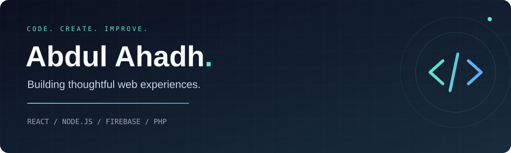
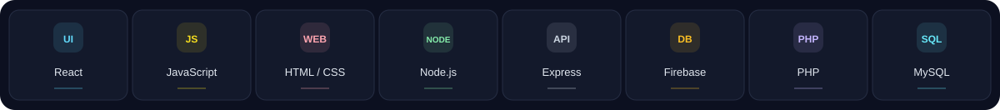
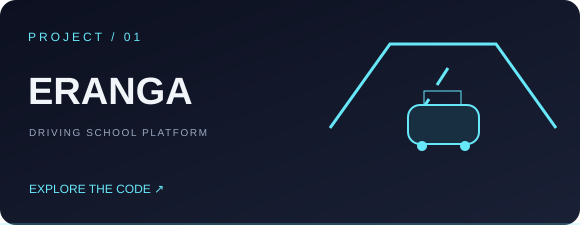
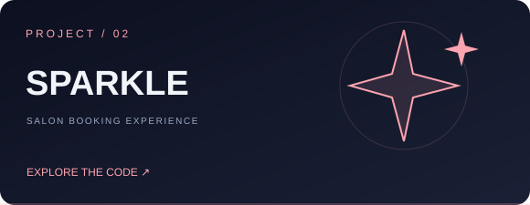
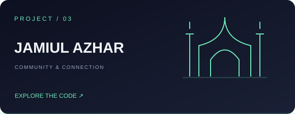
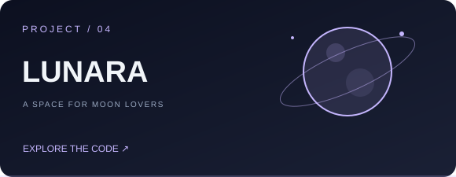
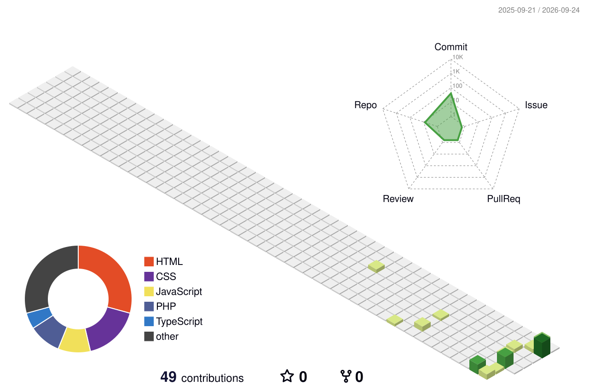

  

  <a href="https://my-potfolio-2-0.vercel.app/"><strong>🌐 Explore my portfolio ↗</strong></a>
  &nbsp;&nbsp; / &nbsp;&nbsp;
  <a href="https://www.linkedin.com/in/m-f-abdul-ahadh-1aa231396"><strong>💬 Let's connect ↗</strong></a>

REAL-WORLD PROJECTS &nbsp; · &nbsp; THOUGHTFUL INTERFACES &nbsp; · &nbsp; CONTINUOUS LEARNING

---

### 01 / Behind the code

I'm **Abdul**, a developer from Sri Lanka with hands-on experience building web applications using **React, JavaScript, Node.js, Express, Firebase, PHP and MySQL**.

I enjoy connecting clean interfaces with useful functionality — from student management and booking flows to community platforms.

- **Building:** the Eranga Driving School Digital Management Platform.
- **Interested in:** full-stack development, responsive interfaces and solving practical problems.
- **Open to:** Intern Software Engineer opportunities and six-month industrial training.

### 02 / My toolkit

<strong>View skills by area</strong>

| Frontend | Backend | Data |
| :--- | :--- | :--- |
| React · JavaScript | Node.js · Express | Firebase · Firestore |
| HTML · CSS | PHP | MySQL |

### 03 / Selected work

<table>
<tr>
<td width="50%" valign="top">

<h3>Eranga Driving School</h3>

A digital platform connecting learners, instructors and administrators, with scheduling, progress tracking, payments and mock theory tests.

<code>React</code> <code>Node.js</code> <code>Firebase</code>

<a href="https://github.com/abdulahadh3148/Eranga-Driving-School-Management-Platform"><strong>Explore the project →</strong></a>
</td>
<td width="50%" valign="top">

<h3>Sparkle Salon</h3>

A salon web application with client appointment booking and an admin dashboard for managing salon operations.

<code>PHP</code> <code>Web application</code>

<a href="https://github.com/abdulahadh3148/Sparkle-Salon"><strong>Explore the project →</strong></a>
</td>
</tr>
<tr>
<td width="50%" valign="top">

<h3>Jamiul Azhar Mosque</h3>

A mosque-focused SaaS project exploring digital tools for community management.

<code>TypeScript</code> <code>SaaS</code>

<a href="https://github.com/abdulahadh3148/Jamiul-Azhar-Mosque"><strong>Explore the project →</strong></a>
</td>
<td width="50%" valign="top">

<h3>LUNARA</h3>

A social web platform for moon lovers, bringing onboarding, interactive feeds and a responsive interface together.

<code>PHP</code> <code>Responsive UI</code>

<a href="https://github.com/abdulahadh3148/LUNARA-FOR-MOON-LOVERS"><strong>Explore the project →</strong></a>
</td>
</tr>
</table>

### 04 / My contribution landscape

<picture>
  <source media="(prefers-color-scheme: dark)" srcset="./profile-3d-contrib/profile-night-rainbow.svg" />
  <source media="(prefers-color-scheme: light)" srcset="./profile-3d-contrib/profile-green-animate.svg" />
  
</picture>

Generated from my GitHub activity and refreshed daily with GitHub Actions.

---

<strong>Have a project or an internship opportunity?</strong> Let's connect through <a href="https://www.linkedin.com/in/m-f-abdul-ahadh-1aa231396">LinkedIn</a> or my <a href="https://my-potfolio-2-0.vercel.app/">portfolio</a>.

